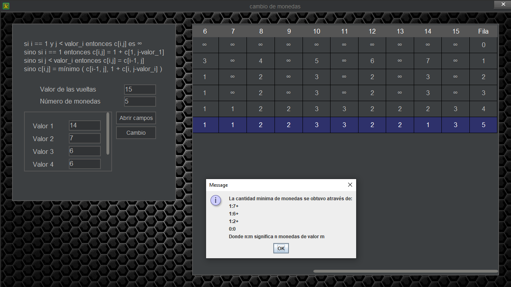

# cambio-de-monedas
💰 Se necesita crear un algoritmo que permita a las máquinas devolver el cambio mediante el menor número de monedas posible. Mediante la programación dinámica se solucionará el caso en el que el número de monedas de cada tipo es ilimitado.✔

